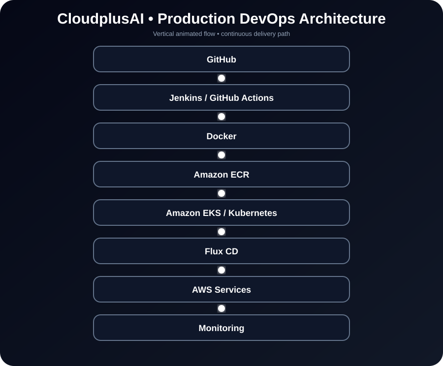
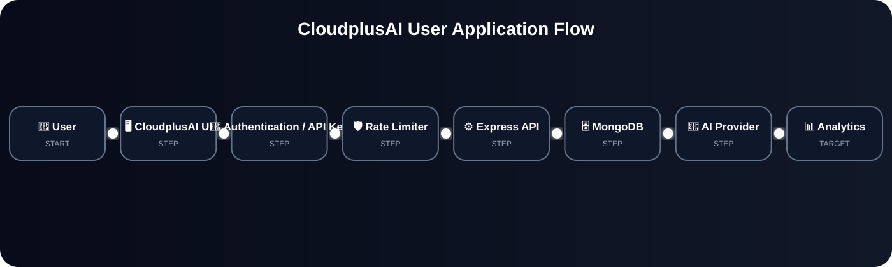
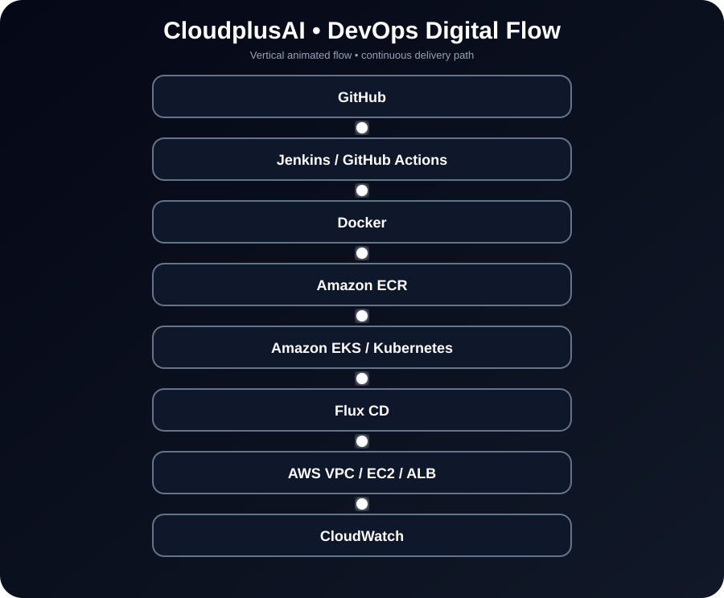
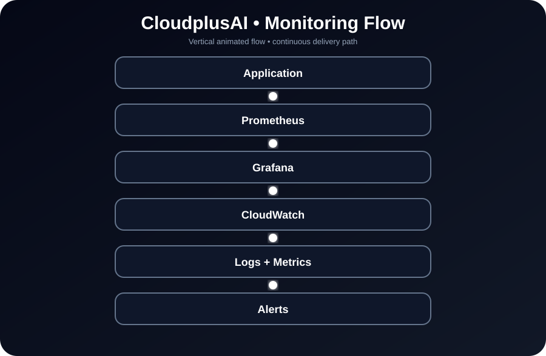
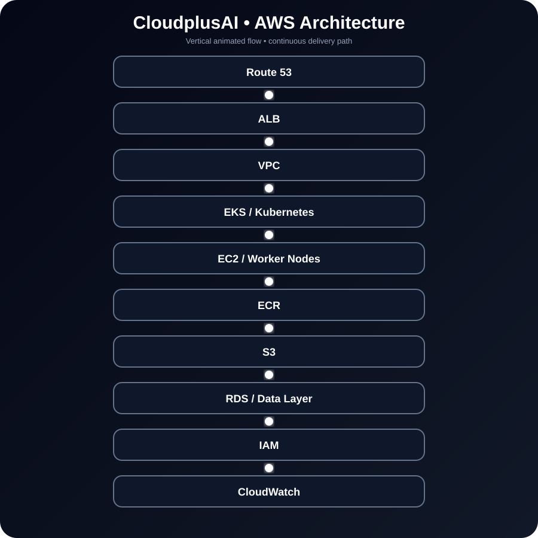
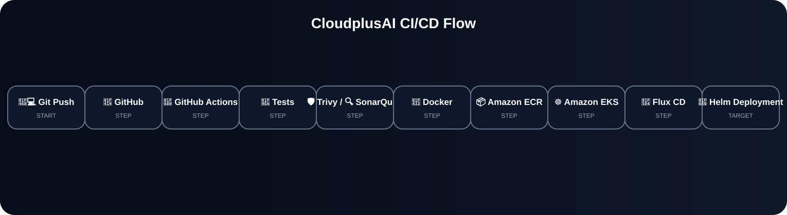
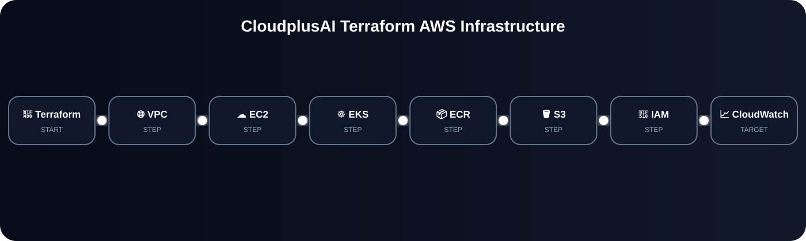
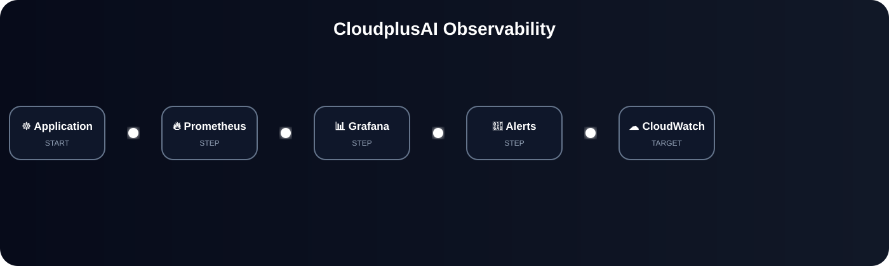
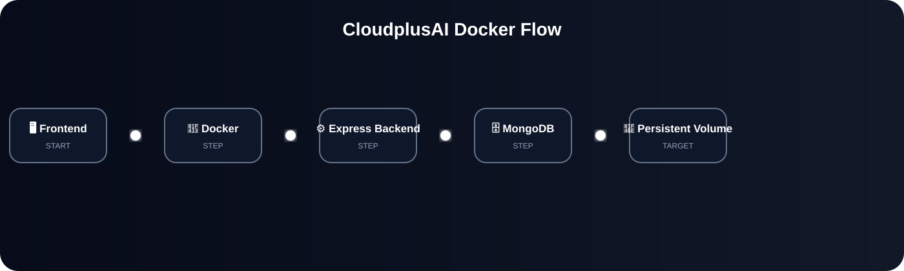

# ☁️ CloudplusAI

<p align="center"><strong>Production-oriented AI Platform & DevOps Showcase</strong><br>AI Chat • Developer API • GPT OSS 20B • API Keys • Analytics • Rate Limiting • Docker • Kubernetes • Terraform • CI/CD • Monitoring</p>

<p align="center"><a href="https://cloudplusai.dreamapexai.online">🌐 Live Demo</a> • <a href="https://github.com/nitindrathod4-alt/CloudplusAI">💻 GitHub Repository</a></p>

<p align="center">
  
  
  
  
  
</p>

<p align="center">      </p>

> CloudplusAI combines an AI application and developer API with a real DevOps/IaC stack. The repository contains application code, containerization, CI/CD, Kubernetes/Helm manifests, Terraform AWS infrastructure, security scanning and monitoring configuration.

## 🖥️ Digital UI & System Flow

### 🎬 Animated Master Architecture

<p align="center"></p>

> GitHub → Jenkins / GitHub Actions → Docker → ECR → Kubernetes/EKS → Flux CD → AWS services, with animated running lines.

### 🔁 User → Application Flow

<p align="center"></p>

### 🚀 DevOps Digital Flow

<p align="center"></p>

### 📈 Monitoring Flow

<p align="center"></p>

## 🤖 Current AI Version

| Component | Current Configuration |
|---|---|
| AI Model | GPT OSS 20B |
| Model ID | openai/gpt-oss-20b |
| AI Provider | Groq API |
| Backend | Railway |
| Database | MongoDB Atlas |

The active AI model is controlled by the backend `GROQ_MODEL` environment variable, so the model can be changed without modifying the frontend.

## 🌐 Live Production Flow

```text
👤 User
  ↓
🌐 CloudplusAI
  ↓
⚙️ Application API
  ├── 🗄️ MongoDB Atlas
  └── 🤖 Groq API → GPT OSS 20B
```

## ⚡ Dynamic Live Status

<!-- DYNAMIC_STATUS:START -->
| Service | Live Status |
|---|---|
| 🌐 Frontend | 🔴 Check failed |
| 🔄 CI | [](https://github.com/nitindrathod4-alt/CloudplusAI/actions/workflows/ci.yml) |
| 🤖 AI Model | `openai/gpt-oss-20b` |
| 🕒 Last automatic check | 2026-09-22 16:40 UTC |
<!-- DYNAMIC_STATUS:END -->

> The live-status section is refreshed automatically by GitHub Actions. GitHub badges and the website check update from the repository/live deployment rather than requiring manual README edits.

## 🚀 Overview

CloudplusAI is designed as a developer-focused AI platform where users can authenticate, chat with AI, persist conversations, manage API keys and inspect usage. The same project demonstrates an end-to-end DevOps lifecycle: source control, automated CI/CD, Docker, AWS infrastructure as code, Kubernetes, Helm, security scanning and observability.

## ✨ Application Features

| Area | Features |
|---|---|
| 👤 Authentication | Registration, login, JWT protection, logout |
| 💬 AI Chat | Interactive chat and conversation persistence |
| 🔑 Developer API | API keys, Bearer authentication and revocation |
| 📚 Developer Portal | API documentation, examples and API tester |
| 📊 Analytics | Usage and activity views |
| 🛡️ API Security | Rate limiting, request validation and 429 protection |
| 🗄️ Database | MongoDB + Mongoose |

## 🛠️ DevOps Stack

| Category | Technology / Service |
|---|---|
| Source Control | Git, GitHub |
| CI/CD | Jenkins, GitHub Actions |
| Containerization | Docker, Docker Compose |
| Cloud | AWS |
| Infrastructure as Code | Terraform |
| AWS Services | VPC, EC2, ECR, S3, RDS, ALB, IAM, Route 53, Auto Scaling, CloudWatch |
| Kubernetes | Amazon EKS, kubectl |
| GitOps | Flux CD |
| Kubernetes Packaging | Helm |
| Web / Ingress | Nginx, Kubernetes Ingress |
| Database | MongoDB |
| Security | Trivy, SonarQube, IAM, API-key controls |
| Monitoring | Prometheus, Grafana, CloudWatch |
| OS / Runtime | Linux, Node.js |

## 🏗️ Architecture

<p align="center"></p>

## 🔄 CI/CD Flow

<p align="center"></p>

## ☁️ Terraform Infrastructure

<p align="center"></p>

## ☸️ Kubernetes & Helm

The repository includes Kubernetes deployment structure and Helm packaging for repeatable releases.

- Backend Deployment and Service
- MongoDB persistence
- Namespace isolation
- Readiness/liveness health checks
- CPU and memory requests/limits
- Horizontal Pod Autoscaling foundation
- Nginx Ingress configuration
- Prometheus configuration and ServiceMonitor
- Grafana deployment configuration
- Helm-based deployment

## 📊 Observability

<p align="center"></p>

## 🔐 Security

- JWT authentication
- API-key authentication and revocation
- Per-key rate limiting
- Request validation
- Trivy vulnerability scanning
- SonarQube integration
- AWS IAM roles and policies
- ECR image scanning
- Kubernetes Secrets for sensitive configuration
- Environment-based configuration
- S3 public-access blocking

**Never commit real AWS credentials, AI provider keys, MongoDB passwords or `.env` files.**

## 🐳 Docker

<p align="center"></p>

> Docker Compose provides local orchestration, while Kubernetes/Helm provides the production-oriented orchestration path.

## 📁 Repository Structure

<!-- DYNAMIC_STRUCTURE:START -->
```text
CloudplusAI/
├── .github/
│   └── workflows/
│       ├── ci.yml
│       ├── deploy.yml
│       ├── devops.yml
│       └── dynamic-readme.yml
├── backend/
│   ├── .env.example
│   ├── api-v1.js
│   ├── Dockerfile
│   ├── features.js
│   ├── package.json
│   └── server.js
├── docs/
│   ├── images/
│   │   ├── architecture-flow.svg
│   │   ├── cicd-flow.svg
│   │   ├── devops-flow.svg
│   │   ├── docker-flow.svg
│   │   ├── monitoring-flow.svg
│   │   ├── observability-flow.svg
│   │   ├── platform-ui.svg
│   │   ├── README.md
│   │   ├── terraform-flow.svg
│   │   └── user-application-flow.svg
│   ├── architecture-flow.md
│   ├── DEPLOYMENT_CHECKLIST.md
│   ├── DEPLOYMENT_RUNBOOK.md
│   ├── MONGODB_ATLAS_SETUP.md
│   └── MONGODB_DEPLOYMENT.md
├── frontend/
│   ├── api-docs.html
│   ├── api-keys.html
│   ├── auth.html
│   ├── dashboard.html
│   ├── Dockerfile
│   ├── index.html
│   ├── nginx.conf
│   ├── nr-logo.png
│   └── settings.html
├── helm/
│   └── cloudplusai/
│       ├── templates/
│       │   ├── _helpers.tpl
│       │   └── backend.yaml
│       ├── Chart.yaml
│       └── values.yaml
├── infra/
│   └── terraform/
│       ├── main.tf
│       ├── providers.tf
│       └── variables.tf
├── kubernetes/
│   ├── autoscaling/
│   │   └── hpa.yaml
│   ├── monitoring/
│   │   ├── grafana-secret.yaml
│   │   ├── grafana.yaml
│   │   ├── prometheus-config.yaml
│   │   ├── prometheus.yaml
│   │   └── servicemonitor.yaml
│   ├── networking/
│   │   └── nginx-ingress.yaml
│   ├── backend.yaml
│   ├── mongodb.yaml
│   └── namespace.yaml
├── monitoring/
│   └── prometheus/
│       └── prometheus.yml
├── terraform/
│   ├── compute.tf
│   ├── eks.tf
│   ├── iam.tf
│   ├── main.tf
│   ├── network.tf
│   ├── outputs.tf
│   ├── README.md
│   ├── variables.tf
│   └── versions.tf
├── .gitignore
├── Cloudplus_AI_Complete_Project_Guide.md
├── docker-compose.yml
└── README.md
```
<!-- DYNAMIC_STRUCTURE:END -->

> This repository tree is generated automatically from the actual GitHub repository structure. New files and folders are reflected automatically.

## 🔌 Developer API

Example protected request:

```http
POST /api/v1/chat
Authorization: Bearer <API_KEY>
Content-Type: application/json
```

```json
{
  "message": "Explain Kubernetes in simple words"
}
```

```bash
curl -X POST http://localhost/api/v1/chat \
  -H "Authorization: Bearer cpa_your_api_key" \
  -H "Content-Type: application/json" \
  -d '{"message":"Hello CloudplusAI"}'
```

Health endpoint:

```bash
curl http://localhost/api/v1/health
```

## 🚦 Rate Limiting

The developer API uses per-key request limiting and returns HTTP `429 Too Many Requests` when the configured limit is exceeded.

```text
Client → API Key validation → Rate-limit check → Request validation → AI request
```

## 🧪 Engineering Validation

| Layer | Validation / Control |
|---|---|
| Git | Version-controlled source |
| CI | GitHub Actions |
| Code Quality | SonarQube integration |
| Container Security | Trivy |
| Image Registry | ECR |
| Infrastructure | Terraform |
| Kubernetes | Health probes + resource policies |
| Scaling | HPA foundation |
| Observability | Prometheus / Grafana configuration |
| Web Layer | Nginx / Ingress |
| API | Authentication + validation + rate limiting |

## ▶️ Local Development

```bash
cp .env.example .env
# configure local environment values
docker compose up --build
```

Do not use production AWS credentials for local development.

## ☁️ Terraform Workflow

From `terraform/`:

```bash
terraform init
terraform fmt -check
terraform validate
terraform plan
```

After reviewing the plan and configuring the intended AWS account:

```bash
terraform apply
```

## 🚀 Deployment Configuration

The GitHub Actions deployment workflow expects environment/repository configuration for:

```text
AWS_REGION
EKS_CLUSTER_NAME
EKS_DEPLOY_ENABLED=true
AWS credentials
```

Prefer short-lived or federated AWS credentials such as GitHub OIDC for production rather than long-lived access keys.

## 🚀 Live Deployment Status

- 🟢 Custom domain: `cloudplusai.dreamapexai.online`
- 🟢 Railway backend
- 🟢 MongoDB Atlas connectivity
- 🟢 Groq AI integration with GPT OSS 20B

## 📌 Project Status

### Application

- 🟢 AI chat application
- 🟢 Authentication
- 🟢 Developer API
- 🟢 API keys
- 🟢 Analytics
- 🟢 MongoDB persistence
- 🟢 Rate limiting and request validation

### DevOps / Infrastructure

- 🟢 GitHub + Git
- 🟢 GitHub Actions
- 🟢 Docker + Compose
- 🟢 Terraform foundation
- 🟢 AWS VPC foundation
- 🟢 ECR/S3 infrastructure definitions
- 🟢 EC2 infrastructure definition
- 🟢 EKS infrastructure definition
- 🟢 Kubernetes + Helm structure
- 🟢 Prometheus/Grafana configuration
- 🟢 HPA / Ingress configuration
- 🟢 Trivy security scanning

### Live environment

- 🟡 AWS resources require `terraform apply` in the target account
- 🟡 Kubernetes monitoring requires deployment to a running cluster
- 🟡 Production CI/CD deployment requires AWS/GitHub environment configuration

This distinction keeps the README technically accurate: **configuration present in Git is not the same as a resource verified live.**

## 💼 Why This Project Stands Out

- 🎬 Animated AWS + DevOps architecture
- 🔧 Jenkins + GitHub Actions CI/CD
- 🐳 Docker containerization
- ☸️ Kubernetes/EKS orchestration
- 🔄 Flux CD GitOps delivery
- 📐 Terraform AWS infrastructure
- 📊 Prometheus, Grafana and CloudWatch observability
- 🔐 Trivy, SonarQube and IAM security controls

## 👨‍💻 Author

**Nitin Rathod**  
**DevOps / Cloud Engineer**

`AWS • Docker • Kubernetes • Terraform • Jenkins • GitHub Actions • Linux`

> **Built to learn. Built to deploy. Built with DevOps in mind. 🚀**
